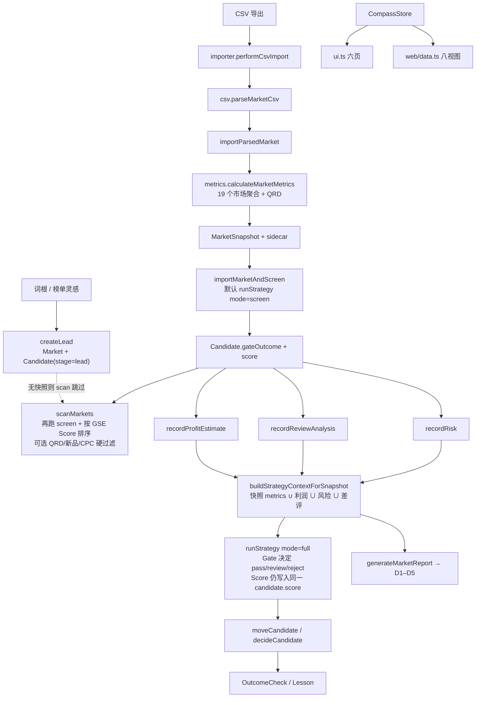
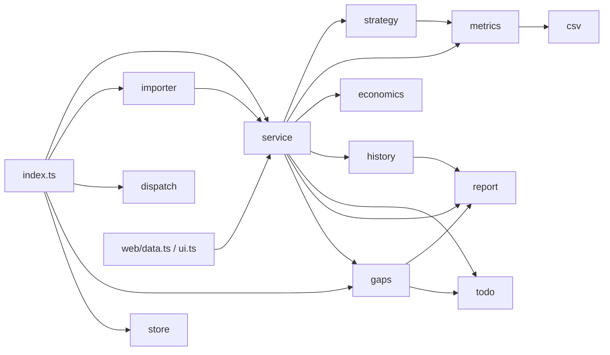
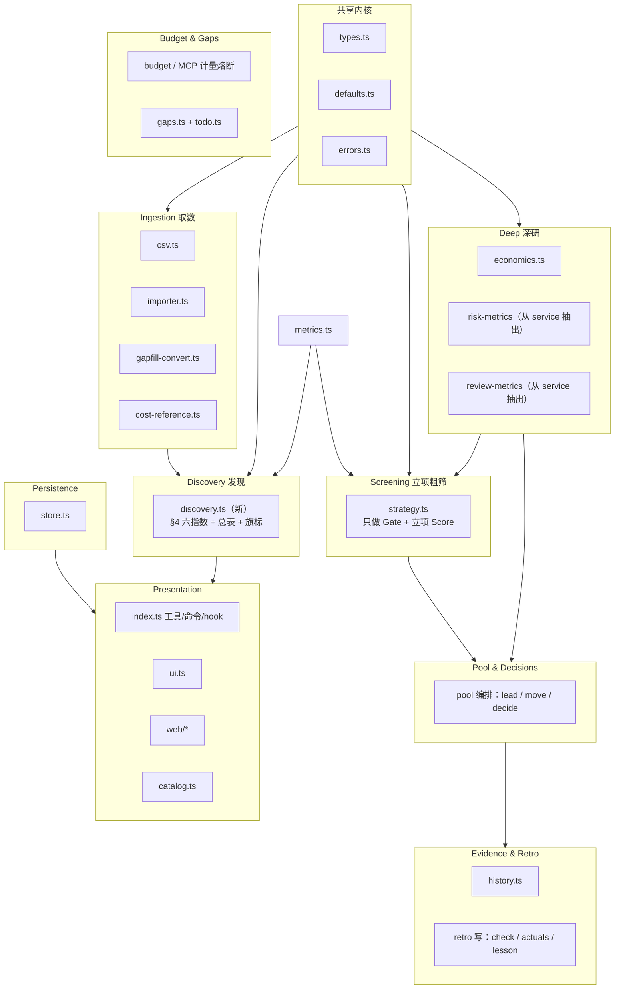
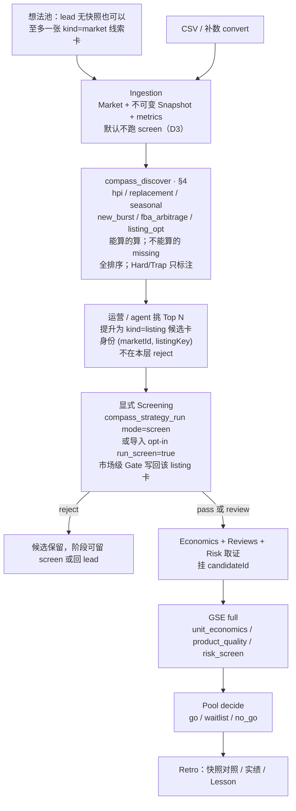

# 罗盘 Compass 架构重设提案：模块边界与数据流

**状态：** 提案（不改生产行为；本 PR 只落地本文）  
**日期：** 2026-09-19（锁定 D1–D3；同日补 §4 六指数规格）  
**范围：** 模块边界、数据流、发现层 / 立项层分工。**不**改 `/compass-strategy`、不改 store 里的策略 YAML、不做大重构。  
**对照材料：** 《亚马逊美国站选品逻辑整合版》（软排序找机会，硬关卡定生死）、`jingpu-daily10` v1、amz-selection 六指数、精铺 SOP。

一句话目标：

> 把「看见机会」和「敢不敢下单」拆成两条可独立演进的链路；分数只排序，Gate 才淘汰。

**已拍板（详见 §0.5）：** Listing 级候选卡（打破一市场一卡）· 独立工具 `compass_discover` · 导入默认不跑 screen。Phase 2–3 按这三条写，不再当开放问题辩论。

**六指数是目标发现层的一等规格**（公式、输入、现状字段、Phase 2 代理），见 **§4**，不是「代码里还没有」一笔带过。

### 目录

1. [§0 调查结论](#0-调查结论先读这段)
2. [§0.5 已锁定决策](#05-已锁定决策2026-09-19)
3. [§1 现状地图](#1-现状地图)
4. [§2 痛点](#2-痛点)
5. [§3 目标架构](#3-目标架构)
6. [**§4 发现层规格：六大选品指数**](#4-发现层规格六大选品指数) ← 目标 Discovery 的完整定义
7. [§5 目标数据流](#5-目标数据流)
8. [§6 迁移计划](#6-迁移计划先划界不大爆炸)
9. [§7 仍开放的问题](#7-仍开放的问题只能由产品--运营拍板)
10. [§8 Phase 1 评审范围](#8-phase-1-落地时怎么辩论)
11. [§9 符号索引](#9-符号索引便于对照代码)

---

## 0. 调查结论（先读这段）

仓库里**已经有一套完整的立项机**（GSE Gate → Score、导入即粗筛、候选池、利润 / 风险 / 差评、复盘），但**没有发现层作为一等公民**。

| 假设 | 核实结果 |
|---|---|
| `store.ts` 是神模块 | **部分成立。** 843 行，职责清楚：`assertStore` + `CompassRepository`（锁 / 原子写 / 路径沙箱 / sidecar）。大，但不是业务编排中心。 |
| `service.ts` 是神模块 | **成立。** 2694 行、约 70 个 export：线索、导入、利润、风险、差评、策略、看板、预算 / MCP、扫描、复盘、待办状态机、历史门面、报告组装、Amazon 链接全挤在一个「纯内存编排」文件里。 |
| `strategy.ts` 是神模块 | **不成立。** 826 行，边界干净：YAML 解析、表达式求值、`evaluateStrategy`、`calculateDimensionScores`。问题不在文件太大，而在**它同时承担立项 Gate 和「扫描排序用的分」**。 |
| 六大发现指数已在代码里 | **不成立。** 全仓零匹配 `HPI` / `隐赚` / `替换机会` / `新品爆发` / `FBA` 套利 / `优化潜力`。最接近的原语只有 `low_rating_high_sales_count`（星级 ≤4.2 且月销 ≥ q 的条数），被塞进 GSE 的 competition / product 维，不是独立指数。 |
| 发现 vs 立项已经分开 | **不成立。** `scanMarkets` 对每个市场跑 `evaluateStrategy(..., "screen")`，再按 **GSE Score** 排序，还可选 `minQrd` / `minNewListingShare` / `maxCpcRatio` / `outcome` **硬过滤**——这正是 amz-selection 反对的「硬阈值过滤」。 |

真正的耦合热点是 **`index.ts`（3001 行，宿主胶水）+ `service.ts`（业务编排）**，不是 `strategy.ts` 或 `store.ts`。

---

## 0.5 已锁定决策（2026-09-19）

下列三条已由产品拍板，从 §6 移出。实现评审不再重开；与之冲突的「建议 / 暂不」措辞以本节为准。

| # | 决策 | 含义 | 不再采用 |
|---|---|---|---|
| D1 | **拆开一市场一卡** | 支持 **Listing 级候选**（同一 `marketId` 下可有多张卡，按 ASIN / listing 身份区分） | 发现结果只停在市场档案附录、看板仍一市场一卡 |
| D2 | **新工具 `compass_discover`** | 发现入口与 `compass_market_scan` **长期分家** | 给 scan 加 `purpose=discover\|screen` 当长期形状 |
| D3 | **导入默认不跑 screen** | 链路是 **先发现、再立项粗筛**；`run_screen=true` 仅显式选择 | 导入默认 `importMarketAndScreen` → `runStrategy(mode=screen)` |

### D1 含义：候选身份键与存量

现行不变量（`createLead` / `importParsedMarket` 里 `candidates.find(item => item.marketId === market.id)`）在 Phase 2–3 **废除**。目标模型：

```
Market 1 ──< MarketSnapshot
     └── * Candidate
           ├ kind = "market"   存量 / 纯线索（无 ASIN）：一词族一张，继续当想法容器
           └ kind = "listing"  新卡：同一市场多张，身份 = (marketId, listingKey)
```

- **`listingKey`（实现时定稿）：** 优先规范化 ASIN（`^[A-Z0-9]{10}$`，与 `amazonProductUrl` 同口径）；CSV 无 ASIN 时用稳定退化键（例如 `rank` + 标题归一），并在卡上标明「身份弱、重导可能重键」。禁止用「该市场唯一一张卡」当查找键。
- **存量迁移：** 已有卡没有 listing 身份 → 视为 `kind=market`。`assertStore` 只加**可选字段**（`asin?` / `listingKey?` / `kind?`），**不**为新字段加硬必填——缺省即旧卡。`schemaVersion` 保持 1。
- **派生待办 id：** 闭环四类 `todo_<kind>_<市场/候选/来源>` 已是持久化格式。Listing 新卡用新的 `candidate.id`（`cand_*`）拼进 id，不改旧卡拼法；**不要**把「市场 id」误当成「该市场所有 listing 卡共享一条待办」。
- **`runStrategy` / 利润 / 风险 / 差评：** 必须带 **显式 `candidateId`**（或列出要写回的卡），禁止再 `find(marketId)` 写「这个市场那一张」。市场级 GSE（`amz_share` / `cr3` / QRD）仍从父市场 `StrategyContext` 读；listing 卡**继承**同一次市场粗筛的 `outcome` 或各自挂 `strategyRunId`，但 **`Candidate.score` 只写 GSE 立项分**，发现分不进这个槽。
- **看板 UX：** `compass_pool` / Web 候选池按市场分组，行上露出 ASIN / 标题 / 发现秩；一市场多卡是默认，不是异常。否决品仍保留、不删除。

### D2 含义：两个工具、两套排序

| 工具 | 层 | 排序键 | 可否按 Gate / QRD 砍行 |
|---|---|---|---|
| `compass_discover`（新） | 发现 | `DiscoveryRank`（§4 六指数 + 总表 composite） | **否**。Hard/Trap 只旗标 |
| `compass_market_scan` | 立项粗筛 | 现有 GSE Score（`evaluateStrategy(..., "screen")`） | 可以（保持现语义，文案改成「立项扫描」） |

`DOMAIN_TOOLS` / `catalog.ts` / `tests/tool-catalog.test.ts` / README·手册·速查卡·SKILL 在 Phase 3 一起加 `compass_discover`。不要用 scan 的 `purpose` 旗标冒充发现入口（短期兼容 shim 若有，也不得写进 SKILL 当主路径）。

### D3 含义：导入不再偷偷立项

- **默认：** `importParsedMarket` 只写 Market + Snapshot +（可选）市场级线索卡；**不**调用 `runStrategy`。`compass_import_csv` / `/compass-import` / Web `POST /api/import` 的 `run_screen` 缺省 = `false`。
- **显式选择：** `run_screen=true` 仍可走现有 `importMarketAndScreen`，给「我已经决定立项粗筛」的运营；这是 opt-in，不是省钱默认。
- **导入后下一步：** `compass_discover` 看全排序 → 人工 / agent 把 Top listing **提升**为 listing 候选卡 → 再 `compass_strategy_run(mode=screen)` 或 opt-in 导入粗筛。
- **`autoCheckImportedOutcome`：** 这是复盘对照（已有人工决策锚点时），不是 screen。默认不跑 screen **不**等于关掉这条复盘；对照仍可在导入事务里按现规则触发。
- Phase 1 **零行为**，本条从 Phase 3 起改默认（或 Phase 2 末若只动导入默认、工具尚未上线，须同步改 SKILL / 手册，避免「导入即粗筛」文案骗人）。

发现 Rank 与立项 Score **分字段**（§3.2）在 D1–D3 下仍然成立：listing 卡可以同时有 `discoveryRank`（派生或随后决定是否落盘，见 Q6）和 `score`（GSE）；展示两列，互不覆盖。

---

## 1. 现状地图

### 1.1 分层（CLAUDE.md 已写、代码大体遵守）

```
index.ts          宿主薄层（目标）/ 实际已膨胀
  ├ importer.ts / gapfill-convert.ts / dispatch.ts     编排 + I/O
  ├ service.ts                                         纯内存编排（实际已膨胀）
  ├ csv / metrics / economics / strategy / history
  │  todo / gaps / report / cost-reference             领域纯函数
  └ store.ts / types.ts / defaults.ts / errors.ts      内核
```

单向依赖大体成立：测试不 import `index.ts`；`todo.ts` / `gaps.ts` / `dispatch.ts` 不 import `service.ts`。破例和热点见 §2。

### 1.2 模块职责与行数

| 文件 | 行数 | 名义职责 | 实际越界 |
|---|---:|---|---|
| `index.ts` | 3001 | 19 个 `compass_*` + `compass_tools` + 9 个 slash + hook | MCP 在途表、补数确认单、1688 同款弹窗、计量 flush、TUI/Web 启动 |
| `service.ts` | 2694 | 「第一参数是 store 的纯内存编排」 | 见 §1.3 的 12 个上下文 |
| `history.ts` | 1109 | 时间线 / 复盘统计 / 报告渲染 | 还被 `service` 再包一层门面（`historyTimeline` 等） |
| `dispatch.ts` | 1058 | 唯一进程内 LLM I/O | 边界好，保持独立 |
| `gaps.ts` | 896 | 只读缺口派生 | import `report.METRIC_LABELS`、`todo` 常量 |
| `store.ts` | 843 | 持久化 + `assertStore` | 大但内聚 |
| `csv.ts` | 826 | 解码 / 嗅探 / 别名 / 数值白名单 | 被 `metrics.ts` 借走 AMZ 样本计数 |
| `strategy.ts` | 826 | GSE 引擎 | Score 与 Gate 同一次 `evaluateStrategy` 返回 |
| `web/data.ts` | 645 | Web DTO | 直接打 `service` 的 15+ 个函数 |
| `todo.ts` | 472 | 待办派生 | 输入由 `service.listWorkbenchTodos` 预计算 |
| `metrics.ts` | 345 | 市场五维指标 | 只产市场聚合，不产发现指数 |
| `report.ts` | 341 | 五维 Markdown | D1–D5 = 立项五维，不是六指数 |
| `defaults.ts` | 350 | 阈值 / `KNOWN_METRIC_NAMES` / 出厂 YAML | 手维护指标全集（四个生产者无注册表） |
| `ui.ts` | 304 | 六页 TUI | 直接打 `service` + `gaps` + `history` |
| `economics.ts` | 177 | 利润公式 | 干净 |
| `catalog.ts` | 112 | `DOMAIN_TOOLS` / `rankTools` | 干净 |
| `importer.ts` | 114 | CSV 导入唯一文件 I/O 链 | 干净 |
| `errors.ts` | 36 | `NotFoundError` / `ValidationError` | 干净 |

### 1.3 `service.ts` 里实际叠了哪些上下文

按 export 区间（便于 Phase 1 原样剪开、零行为变化）：

| 行区（约） | 上下文 | 代表符号 |
|---|---|---|
| 108–296 | 查找 / 缺省注入 | `ensureDefaults` `findMarket` `latestSnapshot` `latestStrategy` |
| 297–486 | 线索 + 导入 + 自动粗筛 | `createLead` `importParsedMarket` `importMarketAndScreen` |
| 488–811 | 利润 / 1688 / 风险 / 差评指标 | `recordProfitEstimate` `recordRisk` `riskMetrics` `reviewMetrics` |
| 813–1013 | 策略上下文 + 跑分 + 存版本 | `buildStrategyContextForSnapshot` `runStrategy` `saveStrategyVersion` `gateThresholds` |
| 1015–1264 | 候选池 + Amazon 链接 + 派发事实 | `moveCandidate` `decideCandidate` `marketAmazonLinks` `dispatchFactsFor` |
| 1266–1684 | 预算月 + MCP 计量 / 熔断 | `budgetMonth` `classifyMcpToolResult` `evaluateMcpGate` `mcpCallTargetServers` |
| 1686–1809 | 「扫描」= 粗筛 + 排序 | `scanMarkets` `metricDivergences` |
| 1986–2164 | 复盘写路径 | `performRetroCheck` `recordRetroActuals` `saveLesson` |
| 2166–2420 | 待办编排 + 闭环状态机 | `listWorkbenchTodos` `submitTodoResolution` `verifyTodoResolution` |
| 2422–2648 | 历史门面 + 回测 + 报告组装 | `historyTimeline` `backtestStrategies` `generateMarketReport` |

`index.ts` 从这里一次 import 了约 50 个符号。任何新领域（发现层）若再塞进 `service.ts`，这个文件会继续当垃圾桶。

### 1.4 领域对象与持久化

`CompassStore`（`types.ts`，`schemaVersion: 1`）顶层集合：

```
Market 1 ──< MarketSnapshot          元数据在 store；listings/keywords 在
     │                               .pi/compass/snapshots/<id>.json sidecar
     └── 1 Candidate                 ★ 现行不变量：一市场一张候选卡
                                       （createLead / importParsedMarket
                                        都是 find by marketId）
                                       目标（D1）：同一市场 * Candidate，
                                       listing 卡身份 = (marketId, listingKey)

ProfitEstimate / CostReference / RiskRecord / ReviewAnalysis
StrategyVersion / StrategyRun
DecisionLog                         type 严格白名单，新增取值 = 回滚砖化
OutcomeCheck / Lesson
BudgetPool / CostEvent
TodoResolution? / CostReference?    可选集合 + ensureDefaults 回填
```

**不落盘、只派生：** `WorkbenchTodo`（`todo.deriveTodos`）、`GapRecord`（`gaps.deriveGaps`）。

**候选卡上同时挂着立项结果：**

```138:159:types.ts
export interface Candidate {
	id: string;
	marketId: string;
	stage: CandidateStage;
	// ...
	gateOutcome?: GateOutcome;
	gateReason?: string;
	score?: number;
	latestStrategyRunId?: string;
	decisionStatus?: DecisionStatus;
	// ...
}
```

`Candidate.score` **只有一个槽**，由 `runStrategy` 每次覆盖（`screen` 或 `full` 都写）。没有 `discoveryRank` / 六指数 / 风险旗标字段。

工作阶段（`CANDIDATE_STAGES`）是运营漏斗，不是 SOP 四关：

`lead → screen → deep_research → risk → decision → testing → review → archived`

SOP / GSE 四阶段（`market_screen` / `unit_economics` / `product_quality` / `risk_screen`）活在策略 YAML 里，与看板阶段**没有代码强制对齐**。`moveCandidate` 允许任意 → 任意，只强制 `reason`。

### 1.5 工具面：agent 被要求怎么走

`catalog.ts` 的 `DOMAIN_TOOLS`（19 个）+ `compass_tools` 动态激活。`skills/compass-selection/SKILL.md` 规定的主路径：

```
compass_lead
  → compass_import_csv（现行默认 run_screen=true → importMarketAndScreen → screen Gate）
  → compass_market_scan（GSE screen + Score 排序，无快照的线索不进表）
  → compass_profit_estimate / compass_reviews_record / compass_risk_check
  → compass_strategy_run(mode=full)
  → compass_market_report
  → compass_pool move / decide
  → compass_retro / compass_history
```

旁路（成本与证据，不是选品判定）：`compass_gaps`、`compass_data_route`、`compass_budget`、`compass_dispatch`、`compass_todo`。

**没有** `compass_discover` / `compass_rank` / 六指数工具。`compass_market_scan` 的 catalog 文案是「扫描…按 Gate、QRD、新品占比筛选」——被当成发现入口，实现却是立项粗筛。

目标主路径（D2 / D3，Phase 3）：`import`（默认不 screen）→ **`compass_discover`** → 提升 listing 卡 → 显式 `screen` / `full` → pool。`compass_market_scan` 留作立项扫描。

Slash：`/compass` `/compass-web` `/compass-import` `/compass-report` `/compass-strategy` `/compass-retro` `/compass-fill` `/compass-history-brief` `/compass-help`。TUI 六页、Web 八视图，读同一 store。

### 1.6 现状数据流



关键副作用：

1. **导入即立项粗筛。** `importMarketAndScreen`（`service.ts`）默认 `runScreen !== false` 就写 Gate。运营还没「选 Top N」，市场已经被 reject / review。
2. **扫描再筛一次。** `scanMarkets` 对已有最新快照的市场再 `evaluateStrategyVersionOnSnapshot(..., "screen")`，`normalize: percentile` 时在**同一批**里重写 `dimensionScores` 与 `score`（**不写回** candidate；candidate.score 仍是上次 `runStrategy` 的有界分）。Web 市场表读的是 candidate 上冻结的 score，和 scan 表可能不是同一个数。
3. **screen 模式下 Score 仍算五维。** `evaluateStrategy` 无论 `mode` 都调用 `calculateDimensionScores`。导入后通常还没有利润 / 风险 / 差评 → `unit_economics` / `product` / `risk` 因缺数走 `average([]) = 50`。权重里这三维合计 **0.55**，扫描排序有一半以上是「缺省 50」。这不是发现指数，是立项综合分的残缺形态。
4. **Listing 不是候选（现状）。** `ListingRecord` 只是快照证据。替换机会、新品苗子、差 Listing 无法变成第二张候选卡——一市场一卡。目标见 D1。

### 1.7 现状依赖（简化）



`service → gaps`（`PROFIT_ASSUMED_DEFAULTS`）是编排层反向依赖派生层，Phase 1 应剪断。

---

## 2. 痛点

### 2.1 发现层缺席，立项层被拿来「找机会」

整合版口径：

| 层 | 原则 |
|---|---|
| 发现 | 六指数全排序；Trap/Hard **只旗标、不删除** |
| 立项 | 硬 Gate；缺硬指标 → `review`；Score **不能**救活红色 Gate |

代码现状：

- **没有**发现指数类型、没有独立排序函数、没有旗标枚举。
- `scanMarkets` 的过滤参数（`outcome` / `minQrd` / `minNewListingShare` / `maxCpcRatio`）是硬阈值删除，与「边界品保留」相反。
- SKILL / README / catalog 把 `compass_market_scan` 写成发现入口，实现是 `market_screen` + GSE Score。
- 无快照线索（纯 `compass_lead`）不进 scan——想法池在工具面上不可见。

### 2.2 一个 `score` 槽、两套语义

`calculateDimensionScores`（`strategy.ts`）维与权重来自 `jingpu-daily10`：**单位经济 0.30 / 竞争 0.25 / 需求 0.20 / 产品 0.15 / 风险 0.10**。

amz-selection 总表是另一套：**市场需求 30% / 竞争 25% / 利润潜力 20% / 品牌真空 10% / 增长 10% / 场景 5%**。

两套都叫「综合分」，公式不同、使用阶段不同，却共用 `StrategyEvaluation.score` 和 `Candidate.score`。`scanMarkets` 用立项分做发现排序；Web 市场行、TUI、报告标题也只展示这一个分。

纪律「分数不能推翻 Gate」在 `evaluateStrategy` 里是守住的：`outcome` 只看规则状态，不算分。模糊发生在**产品表面**：agent 和运营用同一个 Score 决定「先看谁」。

### 2.3 原语被错挂到立项分上

`low_rating_high_sales_count` 是替换机会指数的弱代理（固定 4.2 / q，计数不是 `月销 × (5−评分) × 评论修正`）。它进入 GSE 的 competition **和** product，再进报告 D2/D4。发现信号被立项加权稀释，也无法单独排出「高销低分」清单。

可从现有 `ListingRecord` 近似、但未实现的字段对照，以及目标公式，以 **§4** 为准（这里不再用一张残表代替规格）。

Hard / Capital / Ops / Trap **类目旗标**在现状代码中不存在；风险只有立项用的 `RiskRecord` 五字段。目标旗标见 §4.6。

### 2.4 市场中心 vs 选品中心

精铺 SOP 与 `jingpu-daily10` 是**关键词族 / 市场**中心（QRD、CR3、AMZ 占比）。  
amz-selection 六指数大量是 **ASIN / Listing** 中心。

罗盘把两者压进「一市场一候选卡」。一个词族里同时出现「替换苗子 + 差 Listing + 新品爆款」无法并列进池，只能当同一张卡的证据行。这是产品模型问题，不是改 `scanMarkets` 能单独解决的。

**已锁定（D1）：** Phase 2–3 拆成 Listing 级候选，同一市场多卡进看板。市场级 GSE（QRD / CR3 / AMZ）仍挂在父市场上下文上，不把六指数误当成市场 Gate。

### 2.5 漏斗阶段与策略阶段脱节

看板阶段人工自由跳；GSE 阶段由 YAML 决定。没有「未过 `market_screen` 不得进 deep_research」的代码门。`todo` 只在**已经**处于 `deep_research` 时检查四硬指标（`DEEP_RESEARCH_REQUIRED_FIELDS`），不阻止提前移入。

### 2.6 编排层过载（改边界的工程理由）

- `riskMetrics` / `reviewMetrics` 是 `service.ts` 私有函数，却是 `KNOWN_METRIC_NAMES` 的两个生产者 → 指标注册表只能手写在 `defaults.ts`（注释已承认反向 import 会成环）。
- MCP 熔断 / 归池 / 计量约 400 行住在选品编排文件里；与「Gate vs Score」无关，但拖住每一次拆文件。
- `generateMarketReport` 在 `service` 里拼 DTO，`renderMarketReport` 在 `report.ts`——组装本可留在编排，但把 `metricDivergences` + `budgetStatus` + 策略求值捆在一起，Web 档案页也间接变重。
- `web/data.ts` / `ui.ts` 依赖 `service` 的宽接口，拆 `service` 而不先做门面，展示层会一次性炸。

### 2.7 已经做得对、重设时必须保住的

- Gate 聚合：veto/fail → reject；review/missing/error → review；全过 → pass。缺硬指标不判绿。
- `evaluateStrategy` 的 Score **不**改 `outcome`。
- 快照不可变；明细 sidecar；写事务不嵌套；`decisionLog.type` 白名单。
- 待办派生 + 四类闭环水位；复盘四桶统计唯一所有者在 `history.outcomeStatistics`。
- `dispatch.ts` 零工具 / 零落盘；补数确认单单变量；路径沙箱。
- 测试不经过 `index.ts` 就能跑领域规则。

这些是运营契约。重设是**加边界**，不是重写 GSE。

---

## 3. 目标架构

### 3.1 有界上下文



`metrics.ts` 仍是市场聚合的唯一生产者（QRD / CR / AMZ / 新品占比…）。发现层**只读**这些指标和 listings，**禁止**调用 `evaluateStrategy`，**禁止**写 `gateOutcome`。六指数的公式、输入与缺数规则以 **§4** 为准。

### 3.2 依赖规则（比「别循环 import」更硬）

| 上下文 | 可以依赖 | 禁止 |
|---|---|---|
| Discovery | `metrics` `csv` 类型 `defaults` | `evaluateStrategy`、写 `Candidate.gateOutcome` / `score`、硬过滤删除行 |
| Screening | `strategy` + `StrategyContext`（快照 ∪ 利润 ∪ 风险 ∪ 差评） | 改写发现排序结果；用 Score 改 `outcome`（已有不变式，保持） |
| Economics | `defaults` 阈值 | 自己写 Gate 结论进 candidate |
| Risk / Reviews | `types` | 在发现列表里做 veto |
| Pool | 查找 + 阶段 / 决策写 | 在 `move` 里偷跑策略或发现打分 |
| Retro | `history` + 决策锚点 | 自动翻转 `decisionStatus`（已有纪律） |
| Budget & Gaps | store 只读 + 预算写 | 参与选品判定 |
| Presentation | 组合上述只读 DTO | 在 `index.ts` 里长业务公式 |
| Persistence | `types` + 校验 | 业务规则（Gate / 指数） |

立项 Score 与发现 Rank **不得共用一个字段名**（D1 拆多卡后更要守：一张 listing 卡上两套数并存）：

- `Candidate.score` / `StrategyEvaluation.score`：**继续表示 GSE 立项综合分**（运营已认识）。`runStrategy` 只写这个槽，且必须对准**显式 candidateId**。
- 发现结果用 §4 的 `DiscoveryRank`（六指数具名槽 + 总表 `composite` + 旗标）。Phase 2 **派生不落盘**（与 `WorkbenchTodo` 同族）；是否写入 candidate 可选字段见仍开放的 Q6。**禁止**把发现总分写进 `Candidate.score`。

### 3.3 `service.ts` 的目标形态

不为了好看新建一层「Service 框架」。按现有扁平文件风格，把 `service.ts` **按上下文剪成同级模块**，再留一个很薄的 `service.ts` 做 re-export（Phase 1 零行为，见 §6）。建议落点：

| 新文件（建议） | 搬出的符号 |
|---|---|
| `lookup.ts` 或留在 `service` | `findMarket` `latestSnapshot*` `ensureDefaults` |
| `leads.ts` | `createLead`（Phase 1 仍一市场一卡；Phase 2 起按 `listingKey` 查找，不再 `find(marketId)` 当唯一键） |
| `import-apply.ts`（内存侧，I/O 仍在 `importer.ts`） | `importParsedMarket`；`importMarketAndScreen` 仅服务 **opt-in** `run_screen=true`。Phase 1 搬家不改默认；Phase 3 默认改为不跑 screen（D3） |
| `discovery.ts` | **新**：§4 六指数 + 总表 + 旗标、`rankMarkets` / `rankListings`；listing 身份键；提升为候选卡的纯函数入口（写事务仍走 pool） |
| `screening.ts` | `buildStrategyContext*` `runStrategy` `scanScreen`（现 `scanMarkets` 的 Gate 半截；**不是**发现入口） |
| `profit.ts` | 利润 + 采购价出处解析（写回必须带 `candidateId`，一市场多卡后不能「该市场最新一条」含糊落账） |
| `risk.ts` / `reviews.ts` | `record*` + `*Metrics` 生产者（顺带让 `KNOWN_METRIC_NAMES` 可从生产者登记） |
| `pool.ts` | `moveCandidate` `decideCandidate` `listPoolCandidates` `marketAmazonLinks`；Phase 2–3 按市场分组列出 listing 卡 |
| `budget.ts` | `budgetMonth` 到 `evaluateMcpGate` 整段 |
| `retro.ts` | `performRetroCheck` 到 `generateRetroReport` |
| `todos.ts`（编排，派生仍在 `todo.ts`） | `listWorkbenchTodos` + 闭环四函数 |
| `reporting.ts` | `generateMarketReport` |

`index.ts` 的目标是：**注册、确认弹窗、hook、队列**。补数确认单、MCP 在途表可以下一步再抽 `gapfill-session.ts`，不阻塞发现层。

### 3.4 展示层怎么露两条链路

| 表面 | 发现 | 立项 |
|---|---|---|
| 工具 | **`compass_discover`（D2，长期唯一发现入口）** | `compass_market_scan`（立项扫描）+ `compass_strategy_run`；导入 **opt-in** `run_screen=true`（D3） |
| SKILL | 建池 → 导入（默认不粗筛）→ discover 全排序 → 旗标 → 提升 Top listing 为候选卡 | 再跑 screen → full → decide |
| Web 候选池 | 按市场分组的 **listing 卡**；发现秩 + 旗标；**reject 仍在表里** | Gate / `Candidate.score` 单独列，不覆盖发现秩 |
| Web 市场表 | 市场级发现代理分（可选） | 市场级 Gate（若已显式跑过 screen） |
| TUI 候选池 / 市场页 | 同上 | 同上 |
| 报告 | 「发现附录」：该市场 listing 排序与样本 | 现有 D1–D5 + GSE 规则表 |

**Phase 1 不改这些表面**，只把文档和模块边界准备好。`compass_discover`、导入默认翻转、一市场多卡看板都在 Phase 3 露出，并同步 README / 手册 / 速查卡 / SKILL（四处运营表面）。

---

## 4. 发现层规格：六大选品指数

本节是目标 Discovery 层的**规范定义**，不是现状描述。来源：amz-selection 方法论卡 + 整合版 §3。实现落在 `discovery.ts`，经 `compass_discover`（D2）产出 `DiscoveryRank` / listing 秩。**禁止**写入 `Candidate.score`（那是 GSE 立项分，权重见本节对照表）。

**Q4 已收窄为规范，不再问「要不要这六条」：** 目标模型含全部六指数 + 总表 + 四旗标。Phase 2 对**现有字段够用的分量做代理**，其余分量与整条指数保持 `missing`。缺列再算的指数（季节 / FBA / 主图·A+）进 Phase 5 取数，不从目标模型删除。

### 4.1 纪律（发现层，规范）

1. **全排序，不硬砍。** 边界品留在列表。Hard / Capital / Ops / Trap **只旗标**。不得按 Gate、QRD、新品占比、CPC 删除行（那是立项 `compass_market_scan` 的事）。
2. **缺数据 → 显式 `missing` / 旗标，绝不填默认 50。** `strategy.calculateDimensionScores` 对空维 `average([]) = 50` 是立项残缺形态，发现层禁止复制。乘积公式里任一因子缺失 → **整条指数 `missing`**（不能把缺因子当 1）。可加和的 HPI：只对**有值的分量**加权；缺的分量记入 `missingComponents`，不补 50。
3. **分数只排序。** 发现分不能改 `gateOutcome`，不能救活红色 Gate，不能写成 `Candidate.score`。
4. **经验画像不是硬线。** 「搜索量 2000–8000、ASIN <50、品牌真空 >70%」等只作解读，不作发现层过滤。
5. **样本量。** 建议 ≥3 页 / ≥300 行再信头部以外的排序。`listing_count < 300` 时打 `sample_thin` 旗标，**不删行**。
6. **专利 / 认证 / 备案。** 任何指数都不能替代正式检索（替换机会、FBA 套利尤其如此）。

### 4.2 产物形状（目标类型，尚未写代码）

```
DiscoveryFlag = "hard" | "capital" | "ops" | "trap" | "sample_thin" | "index_missing"

DiscoveryIndexId =
  "hpi" | "replacement" | "seasonal" | "new_burst" | "fba_arbitrage" | "listing_opt"

DiscoveryIndexValue = {
  id: DiscoveryIndexId
  value: number | null          // null = missing，禁止用 50 顶上
  missingComponents: string[]   // 缺的 η / 因子名
  proxy: boolean                // Phase 2 弱公式为 true
  note?: string
}

DiscoveryRank = {
  listingKey: string
  marketId: string
  snapshotId: string
  indices: Record<DiscoveryIndexId, DiscoveryIndexValue>
  composite: number | null      // §4.4 总表；缺维不补 50，见合成规则
  compositeMissing: string[]    // 总表里未参与的维度
  flags: DiscoveryFlag[]
  sampleSize: number
}
```

`compass_discover` 返回一组 `DiscoveryRank`（默认同市场或查询范围内 **listing 全量**，按 `composite` 或调用方指定的单指数排序）。提升为候选卡时只带 `listingKey` + 指向快照；秩默认当场重算（Q6）。

### 4.3 两套权重，禁止混用

| | 发现层总表（§4.4） | GSE 立项分（`calculateDimensionScores` + `jingpu-daily10`） |
|---|---|---|
| 用途 | 想法池 / `compass_discover` 默认合成 | 已进立项的卡排优先级 |
| 写入 | `DiscoveryRank.composite` | `StrategyEvaluation.score` → `Candidate.score` |
| 维度 | 需求 30 / 竞争 25 / 利润潜力 20 / 品牌真空 10 / 增长 10 / 场景·复杂度 5 | 单位经济 0.30 / 竞争 0.25 / 需求 0.20 / 产品 0.15 / 风险 0.10 |
| 缺维 | 该维不参与合成，记 `compositeMissing` | 现状 `average([]) = 50`（立项已知问题，发现层不学） |
| 工具 | `compass_discover` | `compass_strategy_run` / `compass_market_scan` |

六指数是 **listing（及部分市场上下文）上的玩法分**；总表是跨玩法的默认合成。一次 `compass_discover` 应同时给出六槽 + `composite`，以便按玩法切「只看替换」而不丢掉其它指数。

### 4.4 发现层总评分表（默认 composite）

来源：amz-selection §三 / 整合版 §3.7。可按卖家阶段调权（新手加重竞争），但**默认向量如下**，与 GSE 权重无关。

| 维度 id | 权重 | 含义 | Phase 2 代理（有则算，无则该维 missing） |
|---|---:|---|---|
| `demand` | 0.30 | 市场需求（月销 / 搜索量） | listing：`monthlySales`（有限正数）归一；市场上下文可并用 `keyword_search_volume`、`waist_monthly_sales`。销量与搜索量都缺 → 维 missing |
| `competition` | 0.25 | 竞争强度（ASIN 数 / 评论壁垒） | 市场：`listing_count` 反向 + `waist_review_median` 反向 + `cr3` 反向（有哪个用哪个）。三维皆缺 → missing |
| `profit` | 0.20 | 利润潜力（价 − FBA − 佣金） | **仅当**该市场已有 `ProfitEstimate` 且 `gross_margin` 为有限数时用毛利率归一。未测算 → **missing**（不准用价本身假装利润） |
| `brand_vacuum` | 0.10 | 品牌真空 / 集中度 | 页面代理：无品牌 listing 占比（`brand` 空或归一后像 generic / unbranded / 无品牌）。`cr3`/`hhi` 可作集中度补充。无品牌**流量**占比缺 → 记入 `missingComponents`，不补 70% |
| `trend` | 0.10 | 增长趋势（约 6 个月斜率） | Phase 2 **无月序列 → 整维 missing**。禁止用 `new_listing_share_12m` 冒充 6 个月斜率（可另作解读字段，不进本维） |
| `scene` | 0.05 | 场景可描述 / 产品复杂度 | Phase 2 **无 SimilarProductFeature → 整维 missing** |

**合成规则：**  
`composite = Σ (wᵢ / W) × sᵢ`，其中 `sᵢ` 为已归一到 0–100 的有值维，`W` 为有值维权重之和。`W = 0` → `composite = null`。部分维缺失时 `composite` 仍可算，但必须带 `compositeMissing` 且 UI/工具标明「部分维」。**禁止**对缺失维使用 50 或「中性分」。

### 4.5 六指数分条规格

下列公式是目标定义（整合版 / amz-selection 原文）。`ListingRecord` / `KeywordRecord` / `MetricMap` 字段名按仓库现状。Phase 2 只实现标了「代理」的部分；标「缺列」的分量保持 missing。

---

#### 4.5.1 HPI 隐赚指数（蓝海）· `hpi`

**用途：** 找供给薄、需求在、品牌真空、利润看得出的蓝海词/坑。市场上下文重、listing 也可挂同一市场的 HPI 作背景分。

**目标公式：**

```
HPI = η1×需求热度 + η2×供给稀疏度 + η3×利润潜力 + η4×评论壁垒(反向)
    + η5×品牌真空 + η6×增长可持续性 + η7×场景可描述性 + η8×产品复杂度(反向)
```

| 分量 | 来源定义 | 目标输入 | Compass 今天有 | Phase |
|---|---|---|---|---|
| η1 需求热度 | 搜索量 / 月销热度 | `keyword_search_volume`；listing `monthlySales` | 有（词族合计、listing 月销） | **P2 代理**：有搜索量用 log 归一，否则用月销；都缺 → 分量 missing |
| η2 供给稀疏度 | `1 / (每 $1000 营收对应 ASIN 数)` | `listing_count`、`category_monthly_revenue` | 有（营收仅在「每行都有月销额」时才非 null） | **P2 代理**：`1 / max(listing_count / max(revenue/1000, ε), ε)`；营收 missing 则改用「每 $1000 **月销额缺失时用月销×price_p50**」仍缺则分量 missing |
| η3 利润潜力 | 价 − FBA − 佣金 | `gross_margin` 或 listing 价与费率 | 有测算才有 `gross_margin`；listing 有 `price`，无 FBA/佣金列 | **P2**：有 `gross_margin` 才算；否则分量 missing（不拿光秃售价当利润） |
| η4 评论壁垒（反向） | 腰部/头部评论越高壁垒越高 | `waist_review_median`、listing `reviewCount` | 有 | **P2 代理**：`1 / log1p(waist_review_median)` 或 listing 评论；缺 → missing |
| η5 品牌真空 | 无品牌流量占比 × 无品牌页面占比（>70% 为强信号，非硬线） | 流量占比 + 页面占比 | **仅** `brand` → 可算页面占比；**无**无品牌流量 | **P2 代理**：只用页面占比，并 `missingComponents += "unbranded_traffic_share"` |
| η6 增长可持续性 | 趋势是否可持续 | 6 个月斜率 / 新品结构 | 有 `new_listing_share_12m`、`top20_age_months_median`；**无**月序列 | **P2**：本分量 **missing**（不拿新品占比冒充可持续性） |
| η7 场景可描述性 | 场景能否一句话说清 | SimilarProductFeature 一类 | **无** | **缺列** → missing |
| η8 产品复杂度（反向） | 越复杂分越低 | 结构/配件/定制 | **无** | **缺列** → missing |

η 权重：来源未给数值。Phase 2 **对有值分量等权**（`ηᵢ = 1/k`，k = 非 missing 分量数）；k = 0 → `hpi.value = null`。以后校准 η 是实现细节，不删分量。

典型高 HPI 画像（搜索量约 2000–8000、同词 ASIN <50、品牌真空 >70%、利润潜力 >50%）**只作文案**，不作过滤。

---

#### 4.5.2 替换机会指数（高销低分）· `replacement`

**用途：** 需求已验证、体验差，做改进版截流。灰区（月销约 800–1200、评分约 4.0–4.3）必须留下来。

**目标公式：**

```
替换机会指数 = 月销量 × (5 − 评分) × 评论数修正因子
```

| 输入 | 目标 | Compass 今天 | Phase |
|---|---|---|---|
| 月销量 | listing `monthlySales` | `ListingRecord.monthlySales` | 缺 → **整条 missing** |
| 评分 | listing `rating`（0–5） | `ListingRecord.rating`（csv 已做 0–5 校验） | 缺 → **整条 missing** |
| 评论数修正因子 | 来源未给闭式；要压极端爆款评论、抬中等评论 | `ListingRecord.reviewCount` | **P2 代理**（须标注 `proxy: true`）：`reviewAdj = clamp(ln(1 + reviewCount) / ln(1 + 200), 0.25, 1.5)`，200 为具名常量。`reviewCount` 缺 → 整条 missing（不把因子当 1） |
| 类目均分（解读，非公式因子） | 评分显著低于类目均分约 0.5+ | `waist_rating_median` | 有则写 `note`；缺不影响公式本身 |

**禁止**用 `low_rating_high_sales_count`（星级≤4.2 且月销≥q 的**条数**）代替本指数。那条是市场计数，继续给 GSE / 报告用，发现层要的是 **逐 listing 的连续分**。

入场前必须独立查专利；差评若集中在功能缺失而非质量缺陷，改造成本可能更高——发现层只排序，不替代差评分析。

---

#### 4.5.3 季节景气指数 · `seasonal`

**用途：** 按旺季 ROI 与可行动窗口排季节品，不按全年 ROI。

**目标公式：**

```
景气指数 = 峰谷比得分(40%) × 趋势加速度(40%) × 可行动窗口(20%)
```

- 峰谷比不必死卡 3.0×。
- 趋势加速度：今年是否领先去年 2–3 个月（常是备货信号）。
- 可行动窗口：距峰值 2–3 个月立即行动；4–6 个月可计划；已到峰值前夜建议放弃（**放弃是人读建议，发现层只把窗口分打低，不删行**）。

**口径陷阱（规范，写进 `discovery.ts` 注释与测试）：** 类目趋势最后一个月常是**不完整当月**。用首末比会把类目算成暴跌（来源实测：真实 +0.7% 可被算成 −59.1%）。**必须先剔除不完整月**再算同比 / 中期趋势。Compass 今日无 `CategoryTrend` 序列，本陷阱在接入月序列的那一阶段生效，不能用「快照是单月点」假装已经避开。

| 输入 | Compass 今天 | Phase |
|---|---|---|
| 12 个月销量 / 搜索曲线 | **无**。快照是单次切片，没有月序列字段 | **P2：整条 `seasonal` = missing**（`missingComponents` 含 `monthly_series`） |
| 峰值月、峰谷比 | 无 | 有序列后算；不完整月丢弃 |
| `RiskRecord.season_flag` | 立项人工标记 | **不**拿来填季节指数（那是立项证据，不是曲线） |

Phase 5：扩 CSV / MCP 月序列列之后按目标公式实现，并加「含不完整末月 vs 剔除后」的对单测。

---

#### 4.5.4 新品爆发指数 · `new_burst`

**用途：** 7 天爆量苗子排在 28 天稳步爬升者前面。硬阈值按「月销」会误判。

**目标公式：**

```
新品爆发指数 = 月销量 / 上架天数 × 增长加速度（近期日销 / 早期日销）
```

| 输入 | Compass 今天 | Phase |
|---|---|---|
| 月销量 | `monthlySales` | 缺 → 整条 missing |
| 上架天数 | `monthsOnline` × 30.44 或 `launchDate` 相对 `capturedAt` | 有其一即可；都缺 → 整条 missing |
| 增长加速度（近期日销 / 早期日销） | **无**日销曲线 | **P2：本因子 missing → 整条 missing**？见下行 |
| 自然 vs 广告、大促窗口 | 无 ACoS / 品牌词占比 | 缺列；有则降权大促窗口 |

**Phase 2 代理（显式降级，不是目标公式）：** 仅当月销与上架天数都有限且上架天数 ≥ 1 时：

```
new_burst_proxy = monthlySales / daysOnline
```

`proxy: true`，`missingComponents += "growth_acceleration"`。加速度齐了再乘回去。禁止把「月销高、上架很久」的老链接打成高爆发（代理本身已用天数惩罚）。

---

#### 4.5.5 FBA 转换套利指数 · `fba_arbitrage`

**用途：** FBM 出单、Buy Box 价差够、FBA 费吃得下的转换机会。须先核品牌备案；跟卖侵权风险高。

**目标公式：**

```
转换套利指数 = FBM 销量 × Buy Box 价差溢价率 × FBA 费效系数
```

| 输入 | Compass 今天 | Phase |
|---|---|---|
| 配送类型 FBM / FBA | **无** `shippingType`。`seller` 是自由文本，`isAmazon` 不是 FBM | **P2：整条 missing**（`missingComponents` 含 `shipping_type`）。禁止用「非 Amazon」假装 FBM |
| FBM 销量 | 无 | 缺列 |
| Buy Box 价差溢价率 | 无 | 缺列 |
| FBA 费 / 费效 | 无 listing 级 FBA。`ProfitEstimate.fbaFee` 是手填测算，不是该行官方费 | 不拿手填测算冒充该 listing 的 FBA 费效 |
| 大件/重货 | 无尺寸重量 | 有则剔或降权；发现层降权，不删行 |

Phase 5：CSV / MCP 补 `shippingType`、Buy Box、官方 FBA 费后再实现。FBA 费以 Seller Central / Revenue Calculator 为准（与经济学模块同一纪律）。

---

#### 4.5.6 Listing 优化潜力指数 · `listing_opt`

**用途：** 4.3 分但主图差、标题短、无 A+ 的链接，优化空间可能大于满分满配。差 listing 仍出单可能藏致命缺陷 → 查退货 / 差评（发现层不替代）。

**目标公式：**

```
优化潜力指数 = 月销量 × 关键词覆盖缺口 × 主图质量缺口 × 标题质量缺口
```

| 因子 | Compass 今天 | Phase |
|---|---|---|
| 月销量 | `monthlySales` | 缺 → 整条 missing |
| 关键词覆盖缺口 | **无** per-listing 覆盖。市场只有 `KeywordRecord[]` | **P2：因子 missing**（不能用词族搜索量冒充该链接覆盖） |
| 主图质量缺口 | **无** 图 URL / 质量分 / A+ | **P2：因子 missing** |
| 标题质量缺口 | 仅有 `title` 字符串 | **P2 代理（仅此因子）：** `titleGap = clamp(1 − length(title) / 200, 0, 1)`（200 字符为具名上限，代理）。`title` 缺 → 因子 missing |

乘积纪律：三缺口里 Phase 2 只有标题代理 → **整条 `listing_opt` 仍为 missing**（另两个因子缺，不能当 1）。可另输出 `listing_opt_title_gap` 解读字段，避免假装已经有完整优化指数。

Phase 5：补关键词覆盖、主图、A+ 列后按目标乘积实现。

---

### 4.6 风险旗标（只标注，不删除）

来源：amz-selection §四 / 整合版 §3.8。挂在 `DiscoveryRank.flags`，**不是** `RiskRecord`（那是立项五字段 + 官方 URL）。

| 旗标 | 类目示例（来源原文，不是本仓库要落盘的完整经营名单） | 发现层动作 |
|---|---|---|
| 🔴 `hard` | 食品/饮料/保健/医疗器械/婴儿食品/农药/酒精/功能性化妆品 | 必须有资质，独立评审；**不删行** |
| 🟡 `capital` | 服装/鞋包/珠宝/假发/家具/床垫/大件家电 | 退货与库存风险高，显著提示 |
| 🟠 `ops` | 电子/液体/易燃/IP 授权/汽配/玻璃易碎 | 认证、危品、侵权、破损 |
| ⚠️ `trap` | 手机壳/钢化膜/节日装饰/书碟 | 内卷、薄利、季节死库存 |

匹配：`Market.category` 与 listing `category`（有哪个用哪个）。未匹配 = **无旗标**，不是 `clear`。词表放哪见 Q7（开源仓库不宜写死完整经营名单；宿主配置或示例表）。

立项 `risk_screen` 仍按 GSE 对证据做 require/veto。发现旗标 **不**自动写成 `RiskRecord.overall`。

### 4.7 Phase 2 实现对照（对照 §6 迁移）

| 指数 | Phase 2 | 之后 |
|---|---|---|
| `replacement` | **代理整条**（月销 × (5−评分) × ln 评论修正） | 修正曲线可校准 |
| `new_burst` | **代理**：月销/上架天数，加速度 missing | 有日销曲线后乘加速度 |
| `hpi` | **部分代理**（η1/η2/η4/η5 页面；η3 仅有测算时；η6–η8 missing） | 流量真空、月序列、场景/复杂度 |
| 总表 `composite` | 按 §4.4：有维算维，缺维不补 50 | `trend`/`scene` 有列后再进合成 |
| 旗标 | 可配置词表匹配 | 词表运营化（Q7） |
| `seasonal` | **整条 missing** | 月序列 + 剔除不完整月 |
| `fba_arbitrage` | **整条 missing** | shippingType / Buy Box / 官方 FBA |
| `listing_opt` | **整条 missing**（可另给标题缺口解读） | 覆盖 / 主图 / A+ |

Phase 2 验收：`tests/discovery.test.ts` 必须包含「缺因子 → `value === null`、不是 50」的负向用例，以及替换机会灰区（4.0–4.3、月销 800–1200）**不被丢掉**。

---

## 5. 目标数据流



**分数 vs 关卡住在哪：**

| 产物 | 所有者 | 能否淘汰 |
|---|---|---|
| `DiscoveryRank.indices`（六槽）+ `composite` | `discovery.ts` / `compass_discover`（§4） | 否，只排序 |
| `DiscoveryFlag`（Hard/Capital/Ops/Trap + 数据缺口） | `discovery.ts` | 否 |
| `StrategyEvaluation.outcome` | `strategy.evaluateStrategy` | 是（立项） |
| `StrategyEvaluation.score` → `Candidate.score` | 同上，**只给已显式跑过 GSE 的那张卡** | 否 |
| `Candidate.decisionStatus` | `decideCandidate` | 人的终局，系统不因 Score 或发现秩改写 |

导入链路（D3，Phase 3 起改默认；Phase 1 仍零行为）：

1. 现在：`import → metrics → screen Gate → 写「该市场那一张」candidate`。  
2. 目标：`import → metrics →（不写 Gate）→ compass_discover 排 listing → 提升 Top N 为 listing 卡 → 显式 screen`。`run_screen=true` 仍可用，但是选择，不是默认。

Listing 级机会不再只停在档案附录（D1）：Phase 2 按 §4 派生 `DiscoveryRank[]`（六槽 + composite + 旗标）；Phase 3 经 `compass_discover` / pool 提升为真正的 `Candidate`。

---

## 6. 迁移计划（先划界，不大爆炸）

原则：每一步可独立合并；运营工具名、store schema、GSE 判定语义尽量不动；红线（写事务、decisionLog 白名单、缺数据不判绿）每步回归。

### Phase 0 — 本 PR

- 落地本文。
- 不改 TypeScript 行为。
- 不改策略 YAML / `/compass-strategy`。

### Phase 1 — 只剪 `service.ts` / 收窄 import（零行为）

- 按 §3.3 把文件剪开，`service.ts` 做兼容 re-export，测试与 `index.ts` / `web/data.ts` 先不改 import。
- 把 `PROFIT_ASSUMED_DEFAULTS` 挪到 `defaults.ts` 或 `economics.ts`，剪断 `service → gaps`。
- 把 `riskMetrics` / `reviewMetrics` 抽到可被 `defaults` 或集成测试引用的模块，为指标注册表做准备（不必立刻改 `KNOWN_METRIC_NAMES` 的手维护方式）。
- 验收：`npm test` 与 `npm run check` 全绿；无 store 迁移。

风险：低。主要是 git 搬家 + 循环依赖要小心（`lookup` 不要 import `screening`）。

### Phase 2 — 发现层只读派生 + Listing 身份模型（仍不改策略 YAML）

规格以 **§4** 为准（六指数全在目标模型里）。前提按 D1：排序对象是 **listing**。新增 `discovery.ts`，实现 §4.7 的 Phase 2 列：

1. **`listingKey` 纯函数**（ASIN 优先，无 ASIN 退化键）+ 单测；与 `amazonProductUrl` 白名单同口径。
2. **六槽都要出现在 `DiscoveryRank.indices`：** `replacement` / `new_burst` 出代理值；`hpi` 部分代理；`seasonal` / `fba_arbitrage` / `listing_opt` 的 `value` 必须是 `null` 并列出 `missingComponents`——类型上六条都在，不是「先只做两条」。
3. **总表 `composite`：** 按 §4.4 权重合成；缺维不补 50；`trend` / `scene` Phase 2 为 missing。
4. **旗标：** Hard / Capital / Ops / Trap + `sample_thin`（§4.6）。
5. 纯函数 + `tests/discovery.test.ts`（§4.7 负向：缺因子 ≠ 50；替换灰区不丢）。**不写 `Candidate.score`**。
6. 提升为候选卡的 **内存 API**（`promoteListingCandidate` 一类）可在本阶段落地并测「同一市场两张 listing 卡不互相覆盖」；工具面仍可不接。

### Phase 3 — 工具与展示按 D1–D3 露出（运营可感知）

- **新工具 `compass_discover`**（D2）：全排序 listing（可按市场过滤），输出秩 / 指数 / 旗标 / `listingKey`；可选把 Top N **提升**为 `kind=listing` 候选卡。默认不按 Gate / QRD 砍行。
- **`compass_market_scan` 留作立项扫描**（现逻辑），文案不再冒充发现入口。禁止把 `purpose` 旗标当长期形状。
- **导入默认 `run_screen=false`（D3）**：`compass_import_csv` / `/compass-import` / Web 导入向导同步；`run_screen=true` 保留为显式选择。
- **`runStrategy` 写回改显式 `candidateId`**，去掉 `find(marketId)` 唯一卡假设。
- Web / TUI 候选池：按市场分组的 listing 卡；发现秩与 Gate / `score` 分列；reject 行可见。
- 同步四处运营文档 + `catalog.ts` + `tests/tool-catalog.test.ts`。
- SKILL 主路径改为：导入（默认不粗筛）→ `compass_discover` → 提升 Top N → 显式 screen → full → decide。

**此阶段仍不要求改 jingpu-daily10 YAML。**

### Phase 4 — 漏斗与策略阶段的弱对齐（仍可不改 YAML）

- 文档 + 待办：未跑过 screen 或 screen=reject 时，移入 `deep_research` 给警告（先派生待办，不硬拒，避免锁死现有自由跳转）。
- 若要硬拒，必须先回答 Q5。
- 待办派生按 **候选卡** 而不是「一市场一条」，避免一市场多 listing 时水位绑错。

### Phase 5 — 以后才做（本文明确不做）

- `/compass-strategy` 另存版本、出厂稿 vs 本机 v1、风险「红则 veto」、中性市场 `review_if_fail`。
- 为季节 / FBA / A+ 扩 CSV 列与 `KNOWN_METRIC_NAMES`。
- 把发现权重做成第二份 YAML（那是新策略面，不是 GSE 的 stages）。
- （D1 已锁定，不再列「要不要拆一市场一卡」。）

### 对运营保持稳定的契约

**Phase 1（零行为）：**

- 工具名、slash、Web 路由 / `WRITE_PATHS`（现 7 条）。
- `store.json` 形状、`decisionLog.type`、快照 sidecar。
- 导入默认**仍**跑 screen（直到 Phase 3 翻 D3）。
- 缺数据 → review；否决品保留。
- 预算 UTC 月、补数当面确认、dispatch 零工具。

**Phase 3 起预期变化（先写进 SKILL / 手册再切默认）：**

- 多一张工具 `compass_discover`；scan 仍在，语义收窄为立项。
- 导入后不再自动出现 Gate；候选池出现同一市场多张 listing 卡。
- Gate 文案与阈值仍来自生效策略（YAML 不在本重设里改）。

---

## 7. 仍开放的问题（只能由产品 / 运营拍板）

Q1 / Q2 / Q3 已锁定，见 **§0.5 D1–D3**。**Q4 已收窄为规范**（§4 开篇）：六指数 + 总表 + 四旗标都在目标模型里；Phase 2 有数据做代理、没数据保持 missing；缺数据不补 50。下面这些仍影响实现细节与 Phase 4 门闩，**不**挡 Phase 1 剪文件。

**Q4（剩余子问题，不是「要不要六指数」）。**  
η 向量要不要在 Phase 2 之后改成非等权？评论修正的 `200`、标题长度 `200` 是否改成可配常量？这两项不改变公式形状，实现时可以先按 §4.5 的具名常量落地。

**Q5. 看板阶段要不要和 GSE 关卡做硬门？**  
例如 screen=reject 不能进 deep_research。与现行「任意跳转 + 必填 reason」冲突。先警告还是硬拒？一市场多卡后，门闩必须按 **卡** 判，不能按市场一刀切。

**Q6. 发现分要不要落盘？**  
派生（无迁移、改公式即全库重算）vs 写入 candidate 可选字段 / 新集合（可审计、要白名单 / 回滚策略）。建议 Phase 2 先派生；listing 卡提升时可以只存 `listingKey` + 指向当次快照，秩当场重算。

**Q7. 类目旗标词表放哪？**  
本仓库开源，不宜写死真实敏感经营名单。放宿主 `.pi/compass/` 配置（与 gapfill 映射表同模式），还是先做空表 + 示例？

**Q8. agent 能否在发现阶段建议「先扔掉」？**  
整合版说不删。SKILL 是否写明：`compass_discover` 里的 Trap/Hard 只能汇报旗标，`compass_pool decide no_go` 必须发生在立项 Gate 之后？

**Q9. Web / TUI 的主排序键？**  
市场表现在按 `updatedAt`；scan 按 GSE Score。发现层上线后，候选池默认按发现秩、还是按市场分组再按发现秩、还是 Gate 分组？这决定运营每天先看见什么。

**Q10. 无 ASIN 的 listing 如何稳定成卡？**（D1 的实现细节，不是要不要拆卡）  
退化键（rank + 标题归一）在重导、排序漂移时可能撞车或拆成两张。是拒绝提升无 ASIN 行，还是允许弱键并在 UI 标红？

---

## 8. Phase 1 落地时怎么辩论

建议合并本提案后，第一次实现评审（Phase 1）只讨论：

1. §3.3 的剪文件清单是否同意（尤其 MCP 是否跟 Phase 1 一起搬）。  
2. §4 已是发现层规格：**不要**再辩论「要不要六指数」。Phase 2 按 §4.7 做代理 / missing 即可。  
3. D1 的 `listingKey` 草案（ASIN 优先 / 无 ASIN 是否允许提升，Q10）——可在 Phase 1 评审里定口径，代码仍放 Phase 2。

D1–D3 已锁定，**不要**在 Phase 1 评审里重开「要不要拆卡 / 要不要新工具 / 导入是否默认 screen」。

明确**非目标**：重写 GSE DSL、改本机已生效的 `jingpu-daily10` v1、把罗盘做成联网采集平台。

---

## 9. 符号索引（便于对照代码）

| 概念 | 符号 |
|---|---|
| 导入即粗筛 | `importMarketAndScreen` `service.ts` |
| 扫描 = 立项分排序 | `scanMarkets` `service.ts`；工具 `compass_market_scan` `index.ts` |
| Gate + Score 同返回 | `evaluateStrategy` `strategy.ts` |
| 立项五维分 | `calculateDimensionScores` `SCORING_DIMENSIONS` |
| 写回唯一 score 槽 | `runStrategy` → `candidate.score`（目标：只写显式 `candidateId`，不进发现秩） |
| 一市场一卡（**现状**；D1 废除） | `createLead` / `importParsedMarket` 内 `candidates.find(marketId)` |
| 已锁定：Listing 多卡 | §0.5 D1；目标身份 `(marketId, listingKey)` |
| 已锁定：发现工具 | §0.5 D2；`compass_discover` ≠ `compass_market_scan` |
| 已锁定：导入不默认 screen | §0.5 D3；`run_screen` 仅 opt-in |
| 指标全集 | `KNOWN_METRIC_NAMES` `defaults.ts` |
| 替换机会弱原语 | `low_rating_high_sales_count` `metrics.targetDependentMetrics` |
| 报告五维 | `DIMENSIONS` `report.ts` |
| 工具清单 | `DOMAIN_TOOLS` `catalog.ts` |
| 运营工作流 | `skills/compass-selection/SKILL.md` |
| 待办派生 | `deriveTodos` `todo.ts`；编排 `listWorkbenchTodos` |
| Web 写面 | `WRITE_PATHS` `web/server.ts` |
| 发现层规格（目标） | **§4**；`DiscoveryRank` / 六 `DiscoveryIndexId` / 总表权重 / 旗标 |
| HPI | §4.5.1 `hpi` |
| 替换机会 | §4.5.2 `replacement`（≠ `low_rating_high_sales_count`） |
| 季节景气 | §4.5.3 `seasonal`（不完整月陷阱） |
| 新品爆发 | §4.5.4 `new_burst` |
| FBA 套利 | §4.5.5 `fba_arbitrage` |
| Listing 优化 | §4.5.6 `listing_opt` |

---

*本文是设计提案，不是变更日志。D1–D3 已锁定。六指数目标规格见 §4。实现从 Phase 1 剪文件开始；策略 YAML 仍按「以后用 `/compass-strategy` 另存」处理。*
