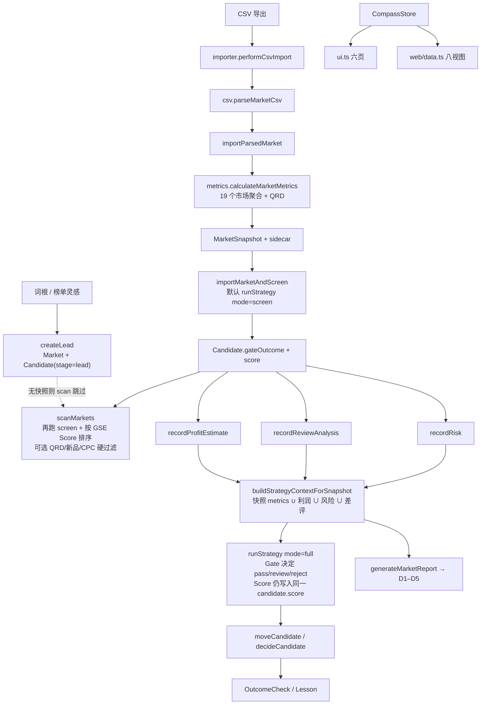
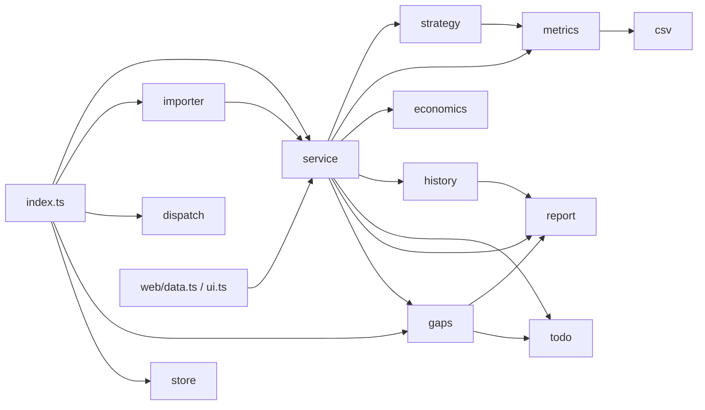
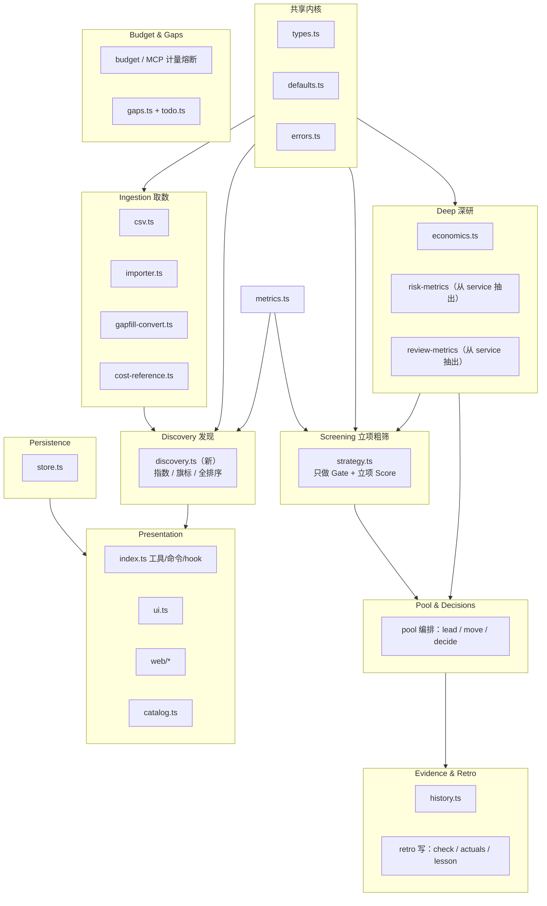
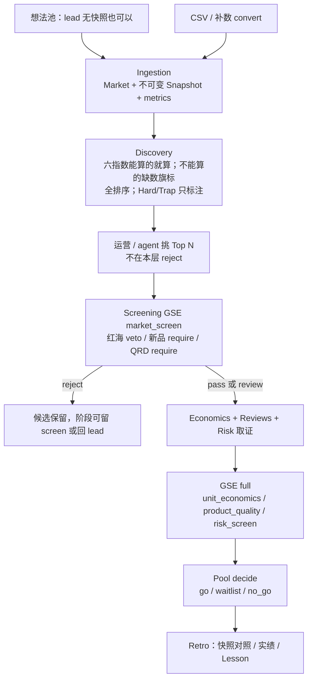

# 罗盘 Compass 架构重设提案：模块边界与数据流

**状态：** 提案（不改生产行为；本 PR 只落地本文）  
**日期：** 2026-09-19  
**范围：** 模块边界、数据流、发现层 / 立项层分工。**不**改 `/compass-strategy`、不改 store 里的策略 YAML、不做大重构。  
**对照材料：** 《亚马逊美国站选品逻辑整合版》（软排序找机会，硬关卡定生死）、`jingpu-daily10` v1、amz-selection 六指数、精铺 SOP。

一句话目标：

> 把「看见机会」和「敢不敢下单」拆成两条可独立演进的链路；分数只排序，Gate 才淘汰。

---

## 0. 调查结论（先读这段）

仓库里**已经有一套完整的立项机**（GSE Gate → Score、导入即粗筛、候选池、利润 / 风险 / 差评、复盘），但**没有发现层作为一等公民**。

| 假设 | 核实结果 |
|---|---|
| `store.ts` 是神模块 | **部分成立。** 843 行，职责清楚：`assertStore` + `CompassRepository`（锁 / 原子写 / 路径沙箱 / sidecar）。大，但不是业务编排中心。 |
| `service.ts` 是神模块 | **成立。** 2694 行、约 70 个 export：线索、导入、利润、风险、差评、策略、看板、预算 / MCP、扫描、复盘、待办状态机、历史门面、报告组装、Amazon 链接全挤在一个「纯内存编排」文件里。 |
| `strategy.ts` 是神模块 | **不成立。** 826 行，边界干净：YAML 解析、表达式求值、`evaluateStrategy`、`calculateDimensionScores`。问题不在文件太大，而在**它同时承担立项 Gate 和「扫描排序用的分」**。 |
| 六大发现指数已在代码里 | **不成立。** 全仓零匹配 `HPI` / `隐赚` / `替换机会` / `新品爆发` / `FBA` 套利 / `优化潜力`。最接近的原语只有 `low_rating_high_sales_count`（星级 ≤4.2 且月销 ≥ q 的条数），被塞进 GSE 的 competition / product 维，不是独立指数。 |
| 发现 vs 立项已经分开 | **不成立。** `scanMarkets` 对每个市场跑 `evaluateStrategy(..., "screen")`，再按 **GSE Score** 排序，还可选 `minQrd` / `minNewListingShare` / `maxCpcRatio` / `outcome` **硬过滤**——这正是 amz-selection 反对的「硬阈值过滤」。 |

真正的耦合热点是 **`index.ts`（3001 行，宿主胶水）+ `service.ts`（业务编排）**，不是 `strategy.ts` 或 `store.ts`。

---

## 1. 现状地图

### 1.1 分层（CLAUDE.md 已写、代码大体遵守）

```
index.ts          宿主薄层（目标）/ 实际已膨胀
  ├ importer.ts / gapfill-convert.ts / dispatch.ts     编排 + I/O
  ├ service.ts                                         纯内存编排（实际已膨胀）
  ├ csv / metrics / economics / strategy / history
  │  todo / gaps / report / cost-reference             领域纯函数
  └ store.ts / types.ts / defaults.ts / errors.ts      内核
```

单向依赖大体成立：测试不 import `index.ts`；`todo.ts` / `gaps.ts` / `dispatch.ts` 不 import `service.ts`。破例和热点见 §2。

### 1.2 模块职责与行数

| 文件 | 行数 | 名义职责 | 实际越界 |
|---|---:|---|---|
| `index.ts` | 3001 | 19 个 `compass_*` + `compass_tools` + 9 个 slash + hook | MCP 在途表、补数确认单、1688 同款弹窗、计量 flush、TUI/Web 启动 |
| `service.ts` | 2694 | 「第一参数是 store 的纯内存编排」 | 见 §1.3 的 12 个上下文 |
| `history.ts` | 1109 | 时间线 / 复盘统计 / 报告渲染 | 还被 `service` 再包一层门面（`historyTimeline` 等） |
| `dispatch.ts` | 1058 | 唯一进程内 LLM I/O | 边界好，保持独立 |
| `gaps.ts` | 896 | 只读缺口派生 | import `report.METRIC_LABELS`、`todo` 常量 |
| `store.ts` | 843 | 持久化 + `assertStore` | 大但内聚 |
| `csv.ts` | 826 | 解码 / 嗅探 / 别名 / 数值白名单 | 被 `metrics.ts` 借走 AMZ 样本计数 |
| `strategy.ts` | 826 | GSE 引擎 | Score 与 Gate 同一次 `evaluateStrategy` 返回 |
| `web/data.ts` | 645 | Web DTO | 直接打 `service` 的 15+ 个函数 |
| `todo.ts` | 472 | 待办派生 | 输入由 `service.listWorkbenchTodos` 预计算 |
| `metrics.ts` | 345 | 市场五维指标 | 只产市场聚合，不产发现指数 |
| `report.ts` | 341 | 五维 Markdown | D1–D5 = 立项五维，不是六指数 |
| `defaults.ts` | 350 | 阈值 / `KNOWN_METRIC_NAMES` / 出厂 YAML | 手维护指标全集（四个生产者无注册表） |
| `ui.ts` | 304 | 六页 TUI | 直接打 `service` + `gaps` + `history` |
| `economics.ts` | 177 | 利润公式 | 干净 |
| `catalog.ts` | 112 | `DOMAIN_TOOLS` / `rankTools` | 干净 |
| `importer.ts` | 114 | CSV 导入唯一文件 I/O 链 | 干净 |
| `errors.ts` | 36 | `NotFoundError` / `ValidationError` | 干净 |

### 1.3 `service.ts` 里实际叠了哪些上下文

按 export 区间（便于 Phase 1 原样剪开、零行为变化）：

| 行区（约） | 上下文 | 代表符号 |
|---|---|---|
| 108–296 | 查找 / 缺省注入 | `ensureDefaults` `findMarket` `latestSnapshot` `latestStrategy` |
| 297–486 | 线索 + 导入 + 自动粗筛 | `createLead` `importParsedMarket` `importMarketAndScreen` |
| 488–811 | 利润 / 1688 / 风险 / 差评指标 | `recordProfitEstimate` `recordRisk` `riskMetrics` `reviewMetrics` |
| 813–1013 | 策略上下文 + 跑分 + 存版本 | `buildStrategyContextForSnapshot` `runStrategy` `saveStrategyVersion` `gateThresholds` |
| 1015–1264 | 候选池 + Amazon 链接 + 派发事实 | `moveCandidate` `decideCandidate` `marketAmazonLinks` `dispatchFactsFor` |
| 1266–1684 | 预算月 + MCP 计量 / 熔断 | `budgetMonth` `classifyMcpToolResult` `evaluateMcpGate` `mcpCallTargetServers` |
| 1686–1809 | 「扫描」= 粗筛 + 排序 | `scanMarkets` `metricDivergences` |
| 1986–2164 | 复盘写路径 | `performRetroCheck` `recordRetroActuals` `saveLesson` |
| 2166–2420 | 待办编排 + 闭环状态机 | `listWorkbenchTodos` `submitTodoResolution` `verifyTodoResolution` |
| 2422–2648 | 历史门面 + 回测 + 报告组装 | `historyTimeline` `backtestStrategies` `generateMarketReport` |

`index.ts` 从这里一次 import 了约 50 个符号。任何新领域（发现层）若再塞进 `service.ts`，这个文件会继续当垃圾桶。

### 1.4 领域对象与持久化

`CompassStore`（`types.ts`，`schemaVersion: 1`）顶层集合：

```
Market 1 ──< MarketSnapshot          元数据在 store；listings/keywords 在
     │                               .pi/compass/snapshots/<id>.json sidecar
     └── 1 Candidate                 ★ 现行不变量：一市场一张候选卡
                                       （createLead / importParsedMarket
                                        都是 find by marketId）

ProfitEstimate / CostReference / RiskRecord / ReviewAnalysis
StrategyVersion / StrategyRun
DecisionLog                         type 严格白名单，新增取值 = 回滚砖化
OutcomeCheck / Lesson
BudgetPool / CostEvent
TodoResolution? / CostReference?    可选集合 + ensureDefaults 回填
```

**不落盘、只派生：** `WorkbenchTodo`（`todo.deriveTodos`）、`GapRecord`（`gaps.deriveGaps`）。

**候选卡上同时挂着立项结果：**

```138:159:types.ts
export interface Candidate {
	id: string;
	marketId: string;
	stage: CandidateStage;
	// ...
	gateOutcome?: GateOutcome;
	gateReason?: string;
	score?: number;
	latestStrategyRunId?: string;
	decisionStatus?: DecisionStatus;
	// ...
}
```

`Candidate.score` **只有一个槽**，由 `runStrategy` 每次覆盖（`screen` 或 `full` 都写）。没有 `discoveryRank` / 六指数 / 风险旗标字段。

工作阶段（`CANDIDATE_STAGES`）是运营漏斗，不是 SOP 四关：

`lead → screen → deep_research → risk → decision → testing → review → archived`

SOP / GSE 四阶段（`market_screen` / `unit_economics` / `product_quality` / `risk_screen`）活在策略 YAML 里，与看板阶段**没有代码强制对齐**。`moveCandidate` 允许任意 → 任意，只强制 `reason`。

### 1.5 工具面：agent 被要求怎么走

`catalog.ts` 的 `DOMAIN_TOOLS`（19 个）+ `compass_tools` 动态激活。`skills/compass-selection/SKILL.md` 规定的主路径：

```
compass_lead
  → compass_import_csv（默认 run_screen=true → importMarketAndScreen → screen Gate）
  → compass_market_scan（GSE screen + Score 排序，无快照的线索不进表）
  → compass_profit_estimate / compass_reviews_record / compass_risk_check
  → compass_strategy_run(mode=full)
  → compass_market_report
  → compass_pool move / decide
  → compass_retro / compass_history
```

旁路（成本与证据，不是选品判定）：`compass_gaps`、`compass_data_route`、`compass_budget`、`compass_dispatch`、`compass_todo`。

**没有** `compass_discover` / `compass_rank` / 六指数工具。`compass_market_scan` 的 catalog 文案是「扫描…按 Gate、QRD、新品占比筛选」——被当成发现入口，实现却是立项粗筛。

Slash：`/compass` `/compass-web` `/compass-import` `/compass-report` `/compass-strategy` `/compass-retro` `/compass-fill` `/compass-history-brief` `/compass-help`。TUI 六页、Web 八视图，读同一 store。

### 1.6 现状数据流



关键副作用：

1. **导入即立项粗筛。** `importMarketAndScreen`（`service.ts`）默认 `runScreen !== false` 就写 Gate。运营还没「选 Top N」，市场已经被 reject / review。
2. **扫描再筛一次。** `scanMarkets` 对已有最新快照的市场再 `evaluateStrategyVersionOnSnapshot(..., "screen")`，`normalize: percentile` 时在**同一批**里重写 `dimensionScores` 与 `score`（**不写回** candidate；candidate.score 仍是上次 `runStrategy` 的有界分）。Web 市场表读的是 candidate 上冻结的 score，和 scan 表可能不是同一个数。
3. **screen 模式下 Score 仍算五维。** `evaluateStrategy` 无论 `mode` 都调用 `calculateDimensionScores`。导入后通常还没有利润 / 风险 / 差评 → `unit_economics` / `product` / `risk` 因缺数走 `average([]) = 50`。权重里这三维合计 **0.55**，扫描排序有一半以上是「缺省 50」。这不是发现指数，是立项综合分的残缺形态。
4. **Listing 不是候选。** `ListingRecord` 只是快照证据。替换机会、新品苗子、差 Listing 无法变成第二张候选卡——一市场一卡。

### 1.7 现状依赖（简化）



`service → gaps`（`PROFIT_ASSUMED_DEFAULTS`）是编排层反向依赖派生层，Phase 1 应剪断。

---

## 2. 痛点

### 2.1 发现层缺席，立项层被拿来「找机会」

整合版口径：

| 层 | 原则 |
|---|---|
| 发现 | 六指数全排序；Trap/Hard **只旗标、不删除** |
| 立项 | 硬 Gate；缺硬指标 → `review`；Score **不能**救活红色 Gate |

代码现状：

- **没有**发现指数类型、没有独立排序函数、没有旗标枚举。
- `scanMarkets` 的过滤参数（`outcome` / `minQrd` / `minNewListingShare` / `maxCpcRatio`）是硬阈值删除，与「边界品保留」相反。
- SKILL / README / catalog 把 `compass_market_scan` 写成发现入口，实现是 `market_screen` + GSE Score。
- 无快照线索（纯 `compass_lead`）不进 scan——想法池在工具面上不可见。

### 2.2 一个 `score` 槽、两套语义

`calculateDimensionScores`（`strategy.ts`）维与权重来自 `jingpu-daily10`：**单位经济 0.30 / 竞争 0.25 / 需求 0.20 / 产品 0.15 / 风险 0.10**。

amz-selection 总表是另一套：**市场需求 30% / 竞争 25% / 利润潜力 20% / 品牌真空 10% / 增长 10% / 场景 5%**。

两套都叫「综合分」，公式不同、使用阶段不同，却共用 `StrategyEvaluation.score` 和 `Candidate.score`。`scanMarkets` 用立项分做发现排序；Web 市场行、TUI、报告标题也只展示这一个分。

纪律「分数不能推翻 Gate」在 `evaluateStrategy` 里是守住的：`outcome` 只看规则状态，不算分。模糊发生在**产品表面**：agent 和运营用同一个 Score 决定「先看谁」。

### 2.3 原语被错挂到立项分上

`low_rating_high_sales_count` 是替换机会指数的弱代理（固定 4.2 / q，计数不是 `月销 × (5−评分) × 评论修正`）。它进入 GSE 的 competition **和** product，再进报告 D2/D4。发现信号被立项加权稀释，也无法单独排出「高销低分」清单。

可从现有 `ListingRecord` 近似、但未实现的：

| 指数 | 现有字段能否起步 | 缺什么 |
|---|---|---|
| 替换机会 | `monthlySales` `rating` `reviewCount` | 类目均分、评论修正曲线 |
| 新品爆发 | `monthlySales` `monthsOnline` / `launchDate` | 日销曲线、广告 vs 自然 |
| HPI 的需求 / 供给 / 评论壁垒 | `keyword_search_volume` `listing_count` `cr*` `waist_review_median` | 品牌真空流量、场景、复杂度 |
| 品牌真空 | `brand`（可算无品牌页占比） | 无品牌**流量**占比 |
| 季节景气 | 无 | 12 个月序列；`CategoryTrend` 末月不完整的坑也未处理 |
| FBA 套利 | 无 `shippingType` | FBM / Buy Box 价差 / FBA 费 |
| Listing 优化 | 仅有 `title` 可测长度 | 主图 / A+ / 关键词覆盖 |

Hard / Capital / Ops / Trap **类目旗标**不存在；风险只有立项用的 `RiskRecord` 五字段（认证 / IP / 季节 / 政策 / 物流），缺证据 → review，不是「标红仍留在列表」。

### 2.4 市场中心 vs 选品中心

精铺 SOP 与 `jingpu-daily10` 是**关键词族 / 市场**中心（QRD、CR3、AMZ 占比）。  
amz-selection 六指数大量是 **ASIN / Listing** 中心。

罗盘把两者压进「一市场一候选卡」。一个词族里同时出现「替换苗子 + 差 Listing + 新品爆款」无法并列进池，只能当同一张卡的证据行。这是产品模型问题，不是改 `scanMarkets` 能单独解决的。

### 2.5 漏斗阶段与策略阶段脱节

看板阶段人工自由跳；GSE 阶段由 YAML 决定。没有「未过 `market_screen` 不得进 deep_research」的代码门。`todo` 只在**已经**处于 `deep_research` 时检查四硬指标（`DEEP_RESEARCH_REQUIRED_FIELDS`），不阻止提前移入。

### 2.6 编排层过载（改边界的工程理由）

- `riskMetrics` / `reviewMetrics` 是 `service.ts` 私有函数，却是 `KNOWN_METRIC_NAMES` 的两个生产者 → 指标注册表只能手写在 `defaults.ts`（注释已承认反向 import 会成环）。
- MCP 熔断 / 归池 / 计量约 400 行住在选品编排文件里；与「Gate vs Score」无关，但拖住每一次拆文件。
- `generateMarketReport` 在 `service` 里拼 DTO，`renderMarketReport` 在 `report.ts`——组装本可留在编排，但把 `metricDivergences` + `budgetStatus` + 策略求值捆在一起，Web 档案页也间接变重。
- `web/data.ts` / `ui.ts` 依赖 `service` 的宽接口，拆 `service` 而不先做门面，展示层会一次性炸。

### 2.7 已经做得对、重设时必须保住的

- Gate 聚合：veto/fail → reject；review/missing/error → review；全过 → pass。缺硬指标不判绿。
- `evaluateStrategy` 的 Score **不**改 `outcome`。
- 快照不可变；明细 sidecar；写事务不嵌套；`decisionLog.type` 白名单。
- 待办派生 + 四类闭环水位；复盘四桶统计唯一所有者在 `history.outcomeStatistics`。
- `dispatch.ts` 零工具 / 零落盘；补数确认单单变量；路径沙箱。
- 测试不经过 `index.ts` 就能跑领域规则。

这些是运营契约。重设是**加边界**，不是重写 GSE。

---

## 3. 目标架构

### 3.1 有界上下文



`metrics.ts` 仍是市场聚合的唯一生产者（QRD / CR / AMZ / 新品占比…）。发现层**只读**这些指标和 listings，**禁止**调用 `evaluateStrategy`，**禁止**写 `gateOutcome`。

### 3.2 依赖规则（比「别循环 import」更硬）

| 上下文 | 可以依赖 | 禁止 |
|---|---|---|
| Discovery | `metrics` `csv` 类型 `defaults` | `evaluateStrategy`、写 `Candidate.gateOutcome` / `score`、硬过滤删除行 |
| Screening | `strategy` + `StrategyContext`（快照 ∪ 利润 ∪ 风险 ∪ 差评） | 改写发现排序结果；用 Score 改 `outcome`（已有不变式，保持） |
| Economics | `defaults` 阈值 | 自己写 Gate 结论进 candidate |
| Risk / Reviews | `types` | 在发现列表里做 veto |
| Pool | 查找 + 阶段 / 决策写 | 在 `move` 里偷跑策略或发现打分 |
| Retro | `history` + 决策锚点 | 自动翻转 `decisionStatus`（已有纪律） |
| Budget & Gaps | store 只读 + 预算写 | 参与选品判定 |
| Presentation | 组合上述只读 DTO | 在 `index.ts` 里长业务公式 |
| Persistence | `types` + 校验 | 业务规则（Gate / 指数） |

立项 Score 与发现 Rank **不得共用一个字段名**。建议：

- `Candidate.score` / `StrategyEvaluation.score`：**继续表示 GSE 立项综合分**（运营已认识）。
- 发现结果用新类型，例如 `DiscoveryRank { total, indices, flags, sampleSize }`，默认**派生不落盘**（与 `WorkbenchTodo` 同族），避免动 `schemaVersion` / `assertStore`。

### 3.3 `service.ts` 的目标形态

不为了好看新建一层「Service 框架」。按现有扁平文件风格，把 `service.ts` **按上下文剪成同级模块**，再留一个很薄的 `service.ts` 做 re-export（Phase 1 零行为，见 §5）。建议落点：

| 新文件（建议） | 搬出的符号 |
|---|---|
| `lookup.ts` 或留在 `service` | `findMarket` `latestSnapshot*` `ensureDefaults` |
| `leads.ts` | `createLead` |
| `import-apply.ts`（内存侧，I/O 仍在 `importer.ts`） | `importParsedMarket`；**自动 screen 改为显式调用方决定**（默认值暂不改，只改存放位置） |
| `discovery.ts` | **新**：指数、旗标、`rankMarkets` / `rankListings` |
| `screening.ts` | `buildStrategyContext*` `runStrategy` `scanScreen`（现 `scanMarkets` 的 Gate 半截） |
| `profit.ts` | 利润 + 采购价出处解析 |
| `risk.ts` / `reviews.ts` | `record*` + `*Metrics` 生产者（顺带让 `KNOWN_METRIC_NAMES` 可从生产者登记） |
| `pool.ts` | `moveCandidate` `decideCandidate` `listPoolCandidates` `marketAmazonLinks` |
| `budget.ts` | `budgetMonth` 到 `evaluateMcpGate` 整段 |
| `retro.ts` | `performRetroCheck` 到 `generateRetroReport` |
| `todos.ts`（编排，派生仍在 `todo.ts`） | `listWorkbenchTodos` + 闭环四函数 |
| `reporting.ts` | `generateMarketReport` |

`index.ts` 的目标是：**注册、确认弹窗、hook、队列**。补数确认单、MCP 在途表可以下一步再抽 `gapfill-session.ts`，不阻塞发现层。

### 3.4 展示层怎么露两条链路

| 表面 | 发现 | 立项 |
|---|---|---|
| 工具 | 新 `compass_discover`（或 `compass_market_scan` 增加 `purpose=discover\|screen`，默认 discover） | 现有 `compass_strategy_run` / 导入后的 screen |
| SKILL | 建池 → 全排序 → 旗标 → 人工挑 Top N | 再跑 screen → full → decide |
| Web 市场表 | 发现总分 + 旗标列；**reject 仍在表里** | Gate 列单独着色，不隐藏行 |
| TUI 市场页 | 同上 | 同上 |
| 报告 | 可选「发现附录」（指数与样本） | 现有 D1–D5 + GSE 规则表 |

**Phase 1 不改这些表面**，只把文档和模块边界准备好。表面改动放 Phase 3，并同步 README / 手册 / 速查卡 / SKILL（四处运营表面）。

---

## 4. 目标数据流



**分数 vs 关卡住在哪：**

| 产物 | 所有者 | 能否淘汰 |
|---|---|---|
| `DiscoveryRank.total` 与分指数 | `discovery.ts` | 否，只排序 |
| `DiscoveryFlag`（Hard/Capital/Ops/Trap + 数据缺口） | `discovery.ts` | 否 |
| `StrategyEvaluation.outcome` | `strategy.evaluateStrategy` | 是（立项） |
| `StrategyEvaluation.score` | 同上，**只给已进立项的卡排优先级** | 否 |
| `Candidate.decisionStatus` | `decideCandidate` | 人的终局，系统不因 Score 改写 |

导入链路建议（**行为默认先不动**，只在文档上标目标）：

1. 现在：`import → metrics → screen Gate → 写 candidate`。  
2. 目标：`import → metrics → 派生 DiscoveryRank →（可选）screen`。自动 screen 仍可当省钱默认，但 scan / 市场表的**主排序**改走发现分；Gate 变成筛选项而不是默认删除键。

Listing 级机会（替换 / 新品 / 差 Listing）目标形态：对最新快照 Top100 **派生** `ListingOpportunity[]`，挂在市场档案里，**暂不**改「一市场一候选」——除非开放问题 Q1 决定拆卡。

---

## 5. 迁移计划（先划界，不大爆炸）

原则：每一步可独立合并；运营工具名、store schema、GSE 判定语义尽量不动；红线（写事务、decisionLog 白名单、缺数据不判绿）每步回归。

### Phase 0 — 本 PR

- 落地本文。
- 不改 TypeScript 行为。
- 不改策略 YAML / `/compass-strategy`。

### Phase 1 — 只剪 `service.ts` / 收窄 import（零行为）

- 按 §3.3 把文件剪开，`service.ts` 做兼容 re-export，测试与 `index.ts` / `web/data.ts` 先不改 import。
- 把 `PROFIT_ASSUMED_DEFAULTS` 挪到 `defaults.ts` 或 `economics.ts`，剪断 `service → gaps`。
- 把 `riskMetrics` / `reviewMetrics` 抽到可被 `defaults` 或集成测试引用的模块，为指标注册表做准备（不必立刻改 `KNOWN_METRIC_NAMES` 的手维护方式）。
- 验收：`npm test` 与 `npm run check` 全绿；无 store 迁移。

风险：低。主要是 git 搬家 + 循环依赖要小心（`lookup` 不要 import `screening`）。

### Phase 2 — 发现层只读派生（仍不改策略 YAML）

新增 `discovery.ts`（名字可议），**只用现有字段**先做能算的：

1. **市场级代理总分**（发现总表的可落地子集）：需求 / 竞争 / 利润潜力（有测算才计，无则缺数不补 50）/ 品牌真空代理（无品牌 listing 占比）/ 增长代理（`new_listing_share_12m` 或 `top20_age_months_median`，并在文档标明不是 6 个月斜率）。
2. **Listing 级替换机会与新品速度**（弱公式，标注「代理」）。
3. **旗标**：先做可配置的类目关键字表（Hard/Trap…），匹配 `Market.category` / listing.category；未匹配 = 无旗标，不是 clear。
4. 纯函数 + `tests/discovery.test.ts`。不写 store，不改 `Candidate.score`。
5. 不接工具面，避免 SKILL 与实现再漂一次。

季节 / FBA / Listing 优化：数据不够就 **显式缺数**，不要用常数填满。

### Phase 3 — 工具与展示把两条链路拆开（运营可感知）

- `scanMarkets` 拆成 `rankForDiscovery`（默认不按 Gate 过滤、不按 QRD 砍行）与 `screenMarkets`（现逻辑）。
- 工具：优先 **加** `compass_discover`，保留 `compass_market_scan` 一段时间以免坏掉旧会话；或给 scan 加 `purpose` 且默认值要在开放问题 Q3 拍板。
- Web / TUI：发现分与 Gate 分列；reject 行可见。
- 同步四处运营文档 + `catalog.ts` + `tests/tool-catalog.test.ts`。
- SKILL「推荐执行顺序」在粗筛前插入「发现排序 → 挑 Top N」。

**此阶段仍不要求改 jingpu-daily10 YAML。** 导入默认 `run_screen=true` 可先保留（省钱），但产品文案要写清：自动粗筛是立项，不是发现。

### Phase 4 — 漏斗与策略阶段的弱对齐（仍可不改 YAML）

- 文档 + 待办：未跑过 screen 或 screen=reject 时，移入 `deep_research` 给警告（先派生待办，不硬拒，避免锁死现有自由跳转）。
- 若要硬拒，必须先回答 Q5。

### Phase 5 — 以后才做（本文明确不做）

- `/compass-strategy` 另存版本、出厂稿 vs 本机 v1、风险「红则 veto」、中性市场 `review_if_fail`。
- 为季节 / FBA / A+ 扩 CSV 列与 `KNOWN_METRIC_NAMES`。
- 拆「一市场多候选」或 Listing 转候选卡。
- 把发现权重做成第二份 YAML（那是新策略面，不是 GSE 的 stages）。

### 对运营保持稳定的契约（Phase 1–2）

- 工具名、slash、Web 路由 / `WRITE_PATHS`（现 7 条）。
- `store.json` 形状、`decisionLog.type`、快照 sidecar。
- 导入默认仍跑 screen；Gate 文案与阈值仍来自生效策略。
- 缺数据 → review；否决品保留。
- 预算 UTC 月、补数当面确认、dispatch 零工具。

---

## 6. 开放问题（只能由产品 / 运营拍板）

**Q1. 候选粒度要不要拆？**  
保持「一市场一卡」（与现行 SOP / QRD 一致），还是允许同一 `marketId` 下多张卡（ASIN / 供应商 / 玩法）？  
不定 Q1，Listing 级指数只能停在档案附录，进不了看板。

**Q2. 导入是否还要默认自动 `screen`？**  
省钱、和现在 SKILL 一致；但会在发现之前写下 `gateOutcome=reject`，市场表第一眼像「已经淘汰」。备选：默认只派生发现分，screen 改显式 / 仅 Top N。

**Q3. 发现入口的工具形状？**  
新工具 `compass_discover`（表面清晰、catalog 要扩），还是 `compass_market_scan` 加 `purpose`（少一个工具、容易继续混用）？默认 purpose 是什么？

**Q4. 六指数的第一批范围？**  
建议 Phase 2 只做：**替换机会代理、新品速度代理、市场级需求/竞争/品牌真空代理、类目旗标**。季节 / FBA / Listing 优化等有列再做。是否同意「缺数据就缺，不补 50」？

**Q5. 看板阶段要不要和 GSE 关卡做硬门？**  
例如 screen=reject 不能进 deep_research。与现行「任意跳转 + 必填 reason」冲突。先警告还是硬拒？

**Q6. 发现分要不要落盘？**  
派生（无迁移、改公式即全库重算）vs 写入 snapshot.metrics 或新集合（可审计、要白名单 / 回滚策略）。建议先派生。

**Q7. 类目旗标词表放哪？**  
本仓库开源，不宜写死真实敏感经营名单。放宿主 `.pi/compass/` 配置（与 gapfill 映射表同模式），还是先做空表 + 示例？

**Q8. agent 能否在发现阶段建议「先扔掉」？**  
整合版说不删。SKILL 是否写明：发现结果里的 Trap/Hard 只能汇报旗标，`compass_pool decide no_go` 必须发生在立项 Gate 之后？

**Q9. Web / TUI 的主排序键？**  
市场表现在按 `updatedAt`；scan 按 GSE Score。发现层上线后，默认按发现分、更新时间，还是 Gate 分组？这决定运营每天先看见什么。

---

## 7. Phase 1 落地时怎么辩论

建议合并本提案后，第一次实现评审只讨论：

1. §3.3 的剪文件清单是否同意（尤其 MCP 是否跟 Phase 1 一起搬）。  
2. Q1 / Q2 / Q3（粒度、自动 screen、工具形状）——卡住 Phase 3 表面，不卡 Phase 1。  
3. Phase 2 代理公式是否允许「弱、但标明代理」，避免等齐六指数才开工。

明确**非目标**：重写 GSE DSL、改本机已生效的 `jingpu-daily10` v1、把罗盘做成联网采集平台。

---

## 8. 符号索引（便于对照代码）

| 概念 | 符号 |
|---|---|
| 导入即粗筛 | `importMarketAndScreen` `service.ts` |
| 扫描 = 立项分排序 | `scanMarkets` `service.ts`；工具 `compass_market_scan` `index.ts` |
| Gate + Score 同返回 | `evaluateStrategy` `strategy.ts` |
| 立项五维分 | `calculateDimensionScores` `SCORING_DIMENSIONS` |
| 写回唯一 score 槽 | `runStrategy` → `candidate.score` |
| 一市场一卡 | `createLead` / `importParsedMarket` 内 `candidates.find(marketId)` |
| 指标全集 | `KNOWN_METRIC_NAMES` `defaults.ts` |
| 替换机会弱原语 | `low_rating_high_sales_count` `metrics.targetDependentMetrics` |
| 报告五维 | `DIMENSIONS` `report.ts` |
| 工具清单 | `DOMAIN_TOOLS` `catalog.ts` |
| 运营工作流 | `skills/compass-selection/SKILL.md` |
| 待办派生 | `deriveTodos` `todo.ts`；编排 `listWorkbenchTodos` |
| Web 写面 | `WRITE_PATHS` `web/server.ts` |

---

*本文是设计提案，不是变更日志。实现从 Phase 1 剪文件开始，策略 YAML 仍按「以后用 `/compass-strategy` 另存」处理。*
